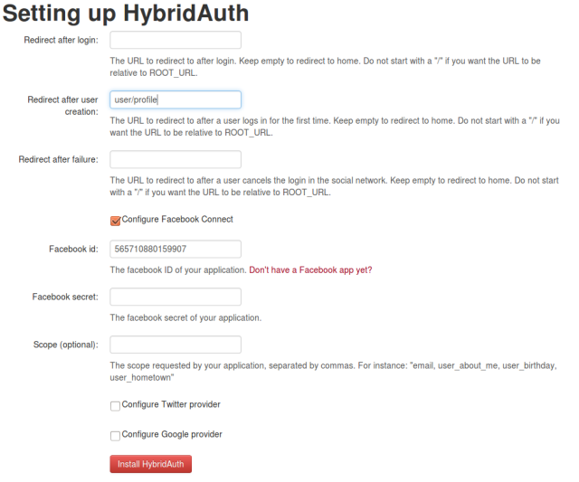
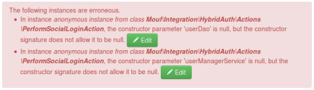

What is this package?
=====================

This package contains a wrapper around the [HybridAuth library](http://hybridauth.sourceforge.net/), binding it to the [Splash MVC framework](http://mouf-php.com/packages/mouf/mvc.splash/index.md) (or to [Druplash](http://mouf-php.com/packages/mouf/integration.drupal.druplash/README.md)).

Use this package to add Facebook/Twitter/Google+/you_name_it connections capability to your application, with minimal effort (about 10 lines of code).

Installation
------------

This package comes with an advanced Mouf install wizard.
To install this package, you must first have a working Mouf environment.
You should also have installed the [UserService](http://mouf-php.com/packages/mouf/security.userservice/) package.
Basically, you should have a running environment where you can log in the "usual" way, using a login and a password.

Ready? Then let's get started.
First step is to add this package to your <code>composer.json</code> and run <code>php composer.phar update</code>.

```json
{
	...
	"require" : {
		"mouf/integration.hybridauth" : "~1.0",
	}
}
```

Once install is done, log into Mouf UI. You will see there is an install process to be run.
Run it.

The install process will propose to configure Facebook, Google or Twitter authentication.  [HybridAuth](http://hybridauth.sourceforge.net/)
supports many other login processes. If you are interested by another login mechanism, you can configure it later.



At the end of the install process, the Mouf status screen will display an error:



Do not panic! This is expected. It only means that we need to explain to HybridAuth how to create a user
in our database. We will do that later. First, let's review quickly the database model.

Database model
--------------

Note: as long as no patch system is available in Mouf, you will have to manually apply a SQL patch to your database.
Go in *vendor/mouf/integration.hybridauth/database/up*, and run the *create_authentications.sql* file. 

This package will add an **authentications** table to your database. This table will point to your users table.
For each user, we might have several authentications. For instance, a user might have a Facebook authentication
and a Google authentication.

Setting up HybridAuth
---------------------
The last install task we have to do is explain to HybridAuth how to create a user. HybridAuth already
knows how to write in the **authentications** table, but it certainly does not know how to write in your "users" table.

For this, we will need to create an instance of a class that implements the <code>UserManagerServiceInterface</code> interface
and feed it to the **PerformSocialLoginAction** instance that was created by the install process.

The <code>UserManagerServiceInterface</code> requires only one method to be coded: 

```php
interface UserManagerServiceInterface {
	
	/**
	 * Creates or update the user $user.
	 * The User ID (in database) is returned.
	 * 
	 * @param AdvancedUserInterface $user The user to save
	 * @return string The user ID
	 */
	public function saveUser(AdvancedUserInterface $user);
}
```

Basically, this method takes a $user variable in parameter and should save it in the database.
It MUST return the user ID.

Here is a typical implementation, using TDBM:

```php
	public function saveUser(\Hybrid_User_Profile $user) {
		// Let's assume we fetch the userDao in the class
		$userDao = $this->userDao;
		if ($user->identifier) {
			// If we have an ID provided, let's fetch it
			$userBean = $userDao->getUserByLogin($user->identifier);
		}
        if(!$userBean) {
			// Else, let's create a new bean
			$userBean = $userDao->create();
			$userBean->setLogin($user->identifier);
		}
		
		// Let's map the fields from $user to the fields of $userBean
		$userBean->setEmail($user->email);
		$userBean->setFirstName($user->firstName);
		$userBean->setName($user->lastName);
		
		// And let's save.
		$userDao->save($userBean);
		return $userBean->getId();
	}
```

That's the only 10 lines of codes you will have to write.

How to use this package
-----------------------

Let's test!
The first thing you want to do is try to log in.
Try to access this URL:
	http://[yourserver]/[yourapp]/authenticate?provider=Facebook
	
(replace Facebook with the provider you choose, for instance Google or Twitter).

The package should redirect you to Facebook and will ask you the authorization to log in.
Click OK. You should be back to your application. You are logged in! Congratulations!

Utility classes and instances
-----------------------------

This package comes with a number of utility instances you can use straight out of the box.

- **facebookConnectButton** (or **xxxConnectButton** depending on your provider): This is a connect button. You can drag'n'drop
this instance in your template (it implements **HtmlElementInterface**).
- **socialProfilePicture**: This is a profile picture of the user currently connected. You can drag'n'drop
this instance in your template (it implements **HtmlElementInterface**).


Mouf package
------------

This package is part of [Mouf](http://mouf-php.com), an effort to ensure good developing practices by providing a graphical dependency injection framework.
