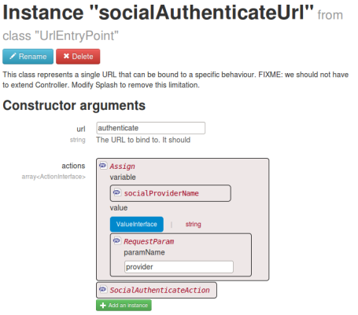
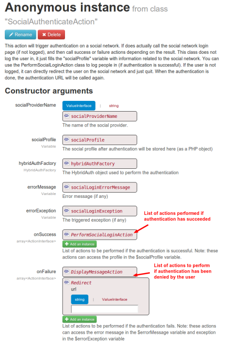

HybridAuth: advanced configuration
==================================

Configuring the URL
-------------------

By default, the login URL is http://[yourwebsite]//[youapp]/authenticate?provider=[yourprovider].
This URL is managed by a **UrlEntryPoint** instance named "socialAuthenticateUrl".

You can change the URL here if you want.
You can also change the name of the parameter ("provider" by default).

As you can see, this URL is calling the **SocialAuthenticateAction**.
Let's have a look at it.

The authentication process
--------------------------

The **SocialAuthenticateAction** is in charge of authenticating the user in a social network.
This action will redirect the user to a social network, to trigger the login process.
Once the login process has been followed, the social network will redirect the user to the
"socialAuthenticateUrl" again.

At this point, the social network will return as a "user profile" if the user has been logged in.
But we have not done anything special yet. The **SocialAuthenticateAction** stores the "user profile"
in the "socialProfile" instance.

The actual work of creating the user in database and logging it is performed by the **PerformSocialLoginAction**.

The login process
-----------------

Once the authentication process has been played, the **PerformSocialLoginAction** is run.
This action will do the following steps:

- Check if the user profile fetched from the social network is already stored in the "authentications" table
- If yes, the user associated is retrieved and logged.
- If no:
	- If the user profile fetched from the social network contains an email address, we test the users table
		to see if the user already exists.
	- If yes, the profile is linked to the existing user
	- If no, a new user is created.
	
